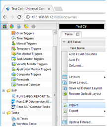
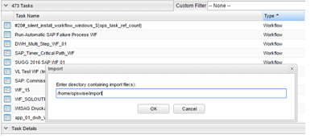
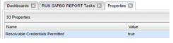
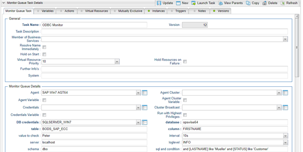
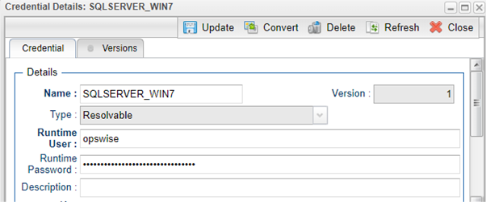
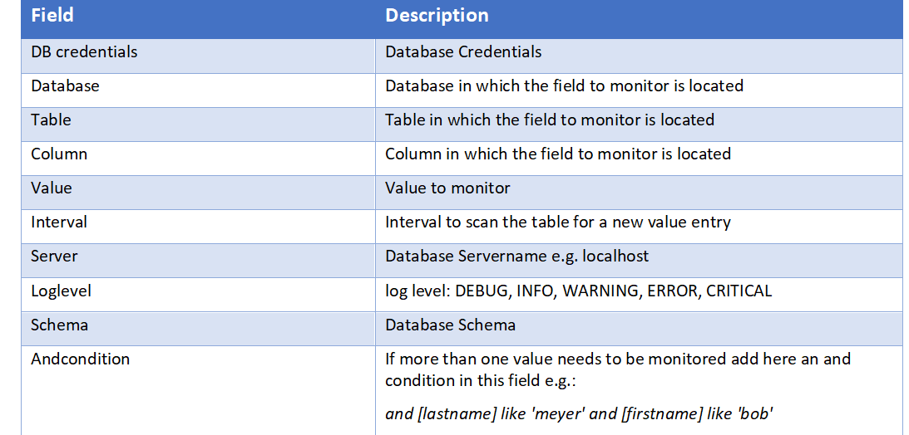
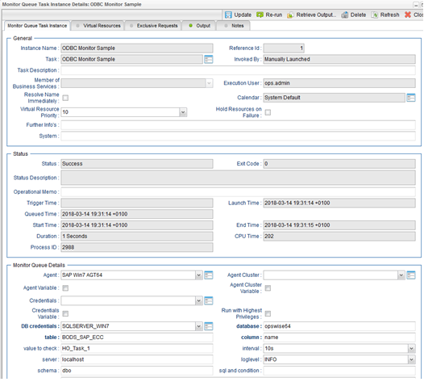
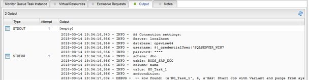
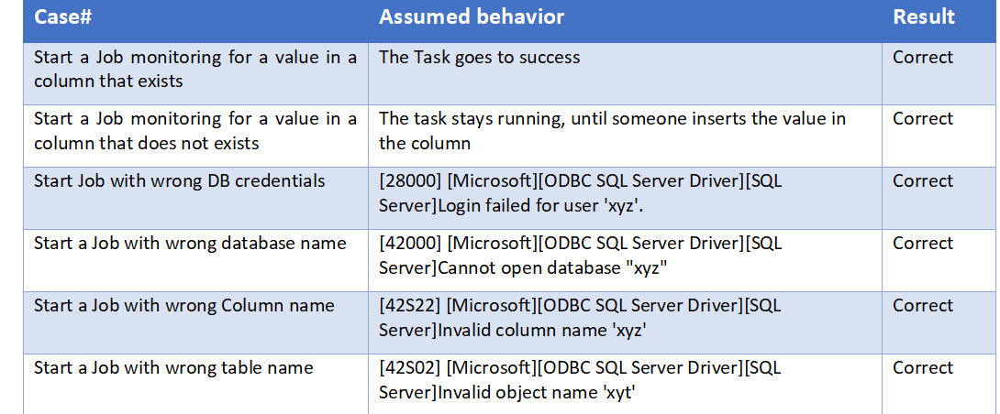
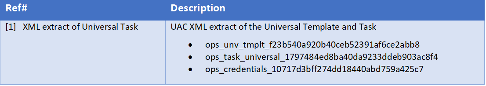

# ut-sqlserver-odbc-monitor-windows
# Abstract:

This Universal Task allows to Monitor a value in a Column in a schema of a SQLSERVER database. If the given value is inserted into the database, the Task goes to success. It is also possible to monitor multiple values within a database table row. 

# 1	Disclaimer

No support and no warranty are provided by Stonebranch GmbH for this document and the related Universal Task. The use of this document and the related Universal Task is on your own risk.

Before using this task in a production system, please perform extensive testing.

Stonebranch GmbH assumes no liability for damage caused by the performance of the Universal Tasks

# 2	Introduction

The here described task has been created to demonstrate how a value in a database column could be monitored in a SQLSERVER database. If you have an Oracle or MySQL database, the python script in the Universal Template could be adjusted to support other databases. 

Some details about the universal task to monitor a value in a database column:
-	The Universal Task allows to monitor one or multiple values in a table Row
-	With minor adjustments the task also runs on a Universal Agent for Linux/Unix
-	The Windows Server needs to have Python 2.7. or higher installed
-	The Windows Server needs to have the Microsoft ODBC driver installed
-	You can configure all connection Parameters via the Universal Task 
-	You can select different log-levels e.g. Info and debug
-	Restriction: Currently only SQLSERVER with SQLSERVER AUTHENTICATION is support 

# 3	Installation
# 3.1	Software Requirements

**Universal Template name: UT_ODBC_MONITOR_WIN**

**Related UAC XML Files for template and task: [2]** 

**Software used:**

For the set-up you need:
1.	Python 2.7.x or higher installed on a server where an Universal Agent is installed. 
2.	For Python the following modules are required: 
       -	sys, for output re-direct processing
       -	datetime, date and time stamps for messages
       -	pyodbc to perform the ODBC connection
       -	logging, for python loglevel support

     Note: Only the module requests need to be added to python 3.6.3
3.	Universal Controller at least 6.4.2.x
4.	Universal Agent 6.3.0.3 or higher installed on a Windows Server
5.	Microsoft ODBC driver installed on the Windows SQLSERVER
6.	A database user with SQLSERVER AUTHENTICATION to perform a select on the table to monitor must be available 

# 3.2	Installation Steps

The following describes the installation steps:
**1.	Install Python 2.7.x for Windows on the Universal Controller server or any Windows Server running a Universal Agent.**

Official Download link: https://www.python.org/downloads/

Note: 

Install python with the options: 

   - add python to windows path
   - Install for all users

**2.	Add the required python modules**

In a dos command shell run as Administrator:
- pip install pyodbc
- pip install datetime
- pip install logging

Note: The module pyodbc contain the commands to perform SQL commands via an ODBC connection a SQLSERVER database. 

It is assumed that the modules sys, datetime are already available. If not install them via pip.

# 3.	Import the Universal Task including the Universal Template to your Controller

Go to “All Tasks” and load via the Import functionality the Universal Task configuration into the Controller. 

 Image 1
   
   
   
 Image 2
   
   
   
# 4	Universal Task Configuration

**1.	Activate: Resolvable Credentials in Universal Automation Center:**

Image 3
   
   
   
**2.	Fill Out the Universal Task for each Report to be scheduled:**

Image 4

   

**Credential for Universal Task:**

Image 5

   

**Description**

Image 6

   

# 5	How to try it out

**Steps:**

1.	Configure an Universal Task as described in [4] to monitor a certain value in a database column
2.	Launch the Universal Task
     1.	In case the Value to Monitor is already in the database, the Universal Task goes to status success. In the output of the task you can see that the value has been found
     2.	In case the Value to Monitor is not yet inserted in the Database the Universal Tasks stays in status “running”, until the value is inserted.
     
Task in status “success” after the value in the database has been identified.

Image 7

   

Output after success:

Image 8:

   

# 6	Test Cases

The following basic test cases has been performed:

Image 9:

   

# 7	Document References

This document references the following documents:

Image 10:

   
   
